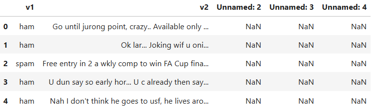
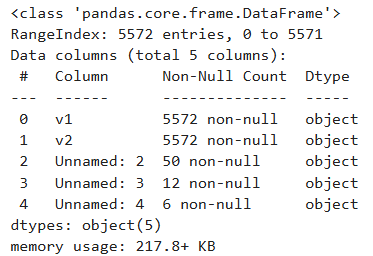
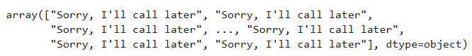
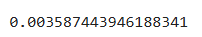

# Implementation-of-SVM-For-Spam-Mail-Detection

## AIM:
To write a program to implement the SVM For Spam Mail Detection.

## Equipments Required:
1. Hardware – PCs
2. Anaconda – Python 3.7 Installation / Jupyter notebook

## Algorithm
1.  Start the Program.

2. Import the necessary packages.

3. Read the given csv file and display the few contents of the data.

4. Assign the features for x and y respectively.

5. Split the x and y sets into train and test sets.

6. Convert the Alphabetical data to numeric using CountVectorizer.

7. Predict the number of spam in the data using SVC (C-Support Vector Classification) method of SVM (Support vector machine) in sklearn library.

8. Find the accuracy of the model.

9. End the Program.

## Program:
```
/*
Program to implement the SVM For Spam Mail Detection..
Developed by: JAYASREE R 
RegisterNumber:  212223230087
*/
```
```
import pandas as pd
data=pd.read_csv("Exp_11_spam.csv",encoding='windows-1252')

data.head()

dat.info()

data.isnull().sum()

x=data["v1"].values

y=data["v2"].values

from sklearn.model_selection import train_test_split
x_train,x_test,y_train,y_test= train_test_split(x,y,test_size=0.2,random_state=0)

from sklearn.feature_extraction.text import CountVectorizer
#CountVectorizer is a method to convert text to numerical data. The text is transformed to a sparse matrix
cv=CountVectorizer()

x_train=cv.fit_transform(x_train)
x_test=cv.transform(x_test)

from sklearn.svm import SVC
svc=SVC()
svc.fit(x_train,y_train)
y_pred=svc.predict(x_test)
y_pred

from sklearn import metrics
accuracy=metrics.accuracy_score(y_test,y_pred)
accuracy
```

## Output:




Data Information:



Y-Predict


Accuracy



## Result:
Thus the program to implement the SVM For Spam Mail Detection is written and verified using python programming.
